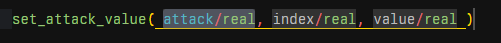
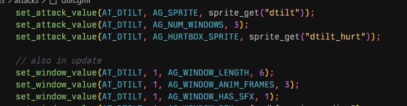
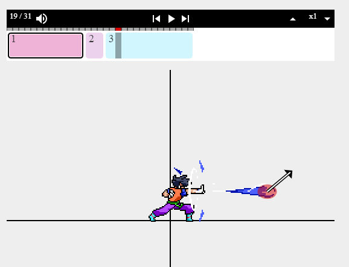
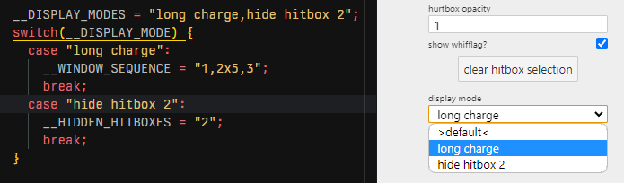

## Overview Video

https://www.youtube.com/watch?v=DS2QaEW_BiA

## Features

### Autocompletion for RoA-specific consts, variables, and functions



### Syntax highlighting for RoA-specific consts, variables, and functions



### A visualizer for RoA workshop moves.

Pull up the command palette with `Ctrl+Shift+P` and select "Open RoABox"


**There is even projectile support!!**



### special visualizer variables!

Use special variables to directly interact with it! Want to simulate a move with repeating windows? Now you can!

```gml
__DISPLAY_MODES = "long charge,hide hitbox 2";
switch(__DISPLAY_MODE) {
  case "long charge":
    __WINDOW_SEQUENCE = "1,2x5,3";
    break;
  case "hide hitbox 2":
    __HIDDEN_HITBOXES = "2";
    break;
}
```

This will create a display mode on the editor:



## Known Issues

none yet!~

## Future Ideas

- possible simulation of a small amount of gml code, allowing for `attack_update.gml`

## Release Notes

### 2.0.0

- added the ability to directly affect the move visualizer with special variables
- added a toggle to simulate hitlag
- added all the functions and macros that have been missing since 2019

fixed:
- animations playing at twice the speed they should
- projectile behavior
- hurtbox display

### 1.4.0

overview

features:
- added debug scripts
- added support for projectiles
- added hurtbox display

Quality of Life:
- default framecount of trajectory line is now 30

### 1.3.0

bugfixes:
- angles will no longer be flipped vertically (oops)

features:
- added a menu to toggle various elements.
- added a trajectory display that will visualize the path an opponent will take
  - this will not take DI into account
  - the right side of the menu is for adjusting the attributes of the opponent

Quality of Life:
- added a button that will automatically fetch the required resources
  - this will only work properly if your top workspace is structured as a workshop character

### 1.2.0

bugfixes:
- using local variables with set/get_whatever_value crashed the webview

features:
- there's now an arrow that shows a hitbox's direction that scales in length with the knockback of the move
- hitboxes with parents will inherit the properties of that parent

### 1.1.2

bugfixes:
- fixed bug preventing visualizer from working if a gml file wasn't opened

### 1.1.0

bugfixes:
- better syntax highlighting
- fixed issue with the ease_back functions

features:
- **new (basic) visualizer added**!
  - press `Ctrl + P (windows) or Cmd + P (mac)` to bring up the command palette, then
    pick "open RoABox." You'll need to set it up by giving it the proper resources, and for now it's still in its *very*
    early stages, but it still may be helpful to quickly see what a move might look like.

### 1.0.0

Initial release
